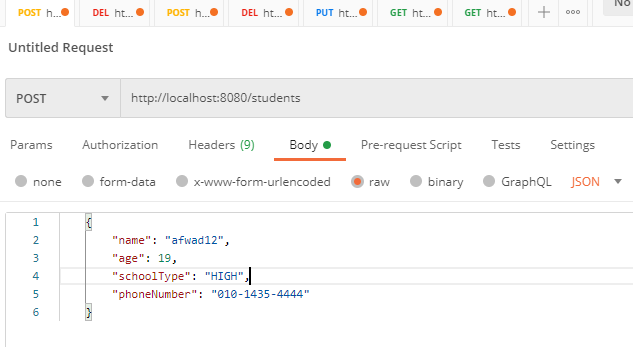
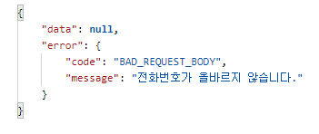
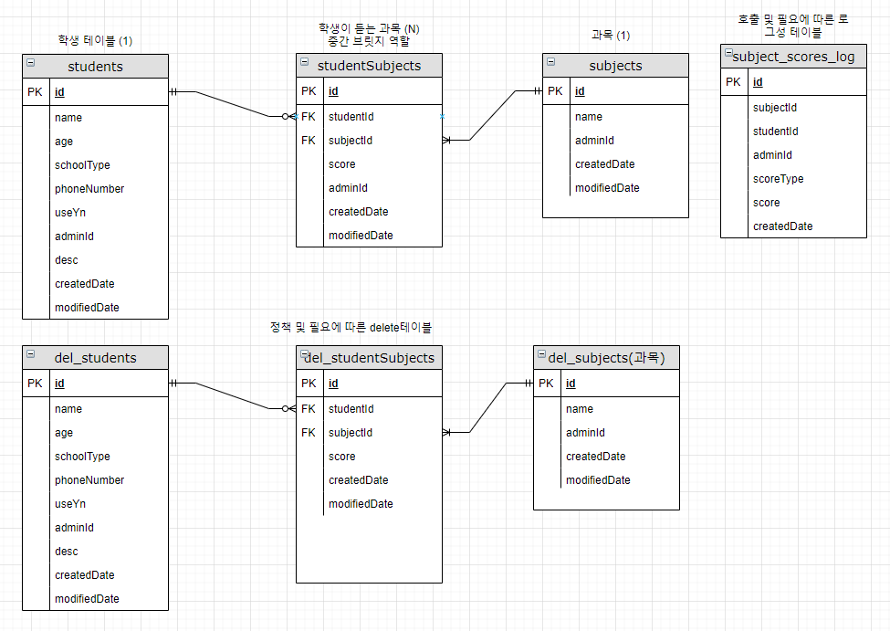
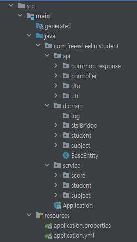

# 실행 방법 및 코드 구조 개요.
 
간단한 실행 방법 및 코드 구조 설명 드리겠습니다.  
[project]  
* SpringBoot : version 2.4.1
* dependency-management : version 1.0.10 RELEASE
* languege :  java(1.8.0_281)
* starter : springBoot starter = web, data-jpa, validation, junit version 5.7.0, lombok, gradle, h2, test starter 등.
* test : useJUnitPlatform()
* jdk version : 1.8.0_144
* dataBase : h2
* ide : intelliJ 2021.2.3 (Ultimate Edition)  
 
* [dataBase] :  접속주소 => http://localhost:8080/h2-console
* 기본 조회 :   
* SELECT * FROM STSJBRIDGE ;
  SELECT * FROM STUDENT ;
  SELECT * FROM SUBJECT  ;
* 
[설치]  
* repository 를 내려받고 싶은 폴더로 이동합니다 ex)D/walkspace/example/...  
* 맥 또는 윈도우 터미널을 여시고 해당 경로로 이동후 git clone [repository 주소]를 입력하시면 됩니다.
* 완료 후, 해당 프로젝트를 여시면 인텔리제이 같은경우는 gradle 및 필요에 따라 환경이 세팅 됩니다.
  
[실행방법]
* 프로젝트는 기본포트 8080 (변경필요시 application.yml -> server.port = {원하시는 port} 변경 하시면 됩니다.  
* 저같은 경우는 postman 사용했지만 필요에 따라 다른 프로그램 사용하셔도 됩니다.

* 보시는 것 처럼 method 설정 및 localhost:8080/호출하고 싶은 주소 입력
* 보내고 싶은 데이터 Body 부분 -> raw 설정 -> JSON 형식으로 호출.
  
[응답]  
 
* 기본 response 형식은 :  {
  "data": null,
  "error": {
  "code": "BAD_REQUEST_BODY",
  "message": "재량껏 작성"
  }
  }   
 따르지만 필요에 따라 다를 수 있습니다.
* 모든 parameter는 valication check를 합니다. 각 parameter마다 메세지가 다릅니다.
* 모든 action 에는 HttpStatus return Code가 다릅니다.
* 등록성공 : 201, 클라이언트쪽 badRequest : 400, 조회성공 : 200, 성공 후 응답없음 :204, 찾을 수 없음 : 404

[테이블 erd]

* 해당 테이블은 학생, 학생이 듣는 과목으로 나누어진 관계로써 중간에 학생이 듣는 과목을 추가하여  
    학생(1) < - > (N) 학생이 듣는 과목 (N) < - > (1) 과목 구조로 만들어 보았습니다.  
* 2개의 테이블로 가져가려면 설계상 맞지않는것 같아서 이러한 구조로 잡게되었습니다.
* 구현은 하지 않았지만 로그 및 삭제 정책에 따른 delete table 구조가 필요해 보이며,  
  테이블 데이터의 삭제는 부담이 될 수 있다 보니 학생 및 과제에 컬럼 ex)use_yn 또는 delete_yn 정도로 두고  
  각각의 테이블에 state 값만 변경하는 것도 좋아보입니다.  
* 해당 테이블에 식별자 테이블을 2개 정도 더 넣는 편인데 일단 편의상 ADMIN_ID라 개별적으로 넣은 필드가 있습니다.
* 추가로 설명하자면 저는 필요에 따라 식별자를 2개 필드 정도 가지고 가며, 누가 호출했는지 와 채널의 영역을 보통 가져갑니다.

[기본 구조]  

* src 폴더 및에 api, domain, service, resources 폴더로 크게 나뉘어져 있으며,  
* api 폴더쪽은 controller, 필요에따른 util class, 기본dto, response class 등이 있으며
* domain 쪽은 jpa 관련한 class
* service는 service 로직을 담당하고 있습니다.
* resources 는 환경 설정 부분을 담당 합니다.
* 기본 설정은 딱히 변경 하실 부분으 없으며, 
* apllication.yml 쪽 batch_size => bulkInsert를 하기위한 queue 싸이즈 설정입니다. 찾아본 결과 jpa bacth insert 는 10000개 정도가 적당해 보입니다.
 

[기타사항]  
* 현재 2틀전부터 심하게 눈에 결막염 비슷한 증상으로 눈을 뜨지 못하고 있어, 테스트 코드를 많이 적지 못한 것 같습니다.
* 요구사항에 맞게 전부 작성 되었으며, 모든 테스트는 통과 되었습니다.

[아쉬운점]  
* 눈이 아파 리펙토링을 못하고 있다는 점.....jpa를 현재 배우는 단계라 좀 더 깔끔하게 코드를 작성 못한 점(쿼리는 쉽습니다.) 
* 호출에 따른 로그 테이블도 남겼다면더 좋았겠다 라는 점.

[etc]  
* 추후 개별적으로 다시 리펙토링 및 안써본 자바 문법 또는 다른 디자인 패턴으로 하나 더 만들어 보겠다는것.